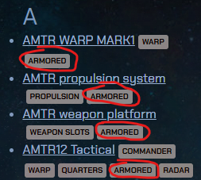

# Combat Ships and Combat Tactics

* TOC
{:toc}

In Outspace, combat is usually fought by players against [Evil](https://source.outspacegame.com/en/lore/evil/). Fighting against ships and stations of other players or NPCs is technically possible, but at the moment there is an unwritten rule that we do not attack.

A basic combat ship can be built relatively early from modules that can be purchased at NPC stations for reasonable prices. At the beginning the ship will be small and quite weak, but sufficient for training combat with small enemies. Over time, players gradually upgrade their ships, add new and better modules, and can eventually defeat almost anything.

This guide is intended for new players to help them build and later upgrade a basic combat ship built on the AMTR platform. With such a ship you can destroy practically any kind of Evil except [Leviathan](https://source.outspacegame.com/en/lore/evil/list/20/), which is enough for most players for many months. Later, once players gain experience, equipment, and money, it’s no problem to move on to larger ships.

> **A tip worth gold:**  
> When you first enter the zone, you will certainly be impressed by the enormous combat ships with which experienced players slaughter everything alive in the area in no time. These are ships built on CMTR or HLO platforms. You will be tempted to immediately own such a ship and rule the universe with it, which is not a problem in the zone.  
> **DON’T DO IT!!!**

Large combat ships have their purpose, but they also have huge disadvantages:

- they are extremely heavy – just turning on the spot takes several minutes
- they are slow – by the time they accelerate to warp speed, you could celebrate two birthdays (okay, maybe just one)
- a fully equipped HLO ship will require several dozen (!!) well-trained astronauts
- the combat itself is not as fun as with small, fast ships

---

## Building your first combat ship

We will build the first combat ship on the AMTR platform. Notice that in Source all modules we will use are tagged with the **“armored”** label. Do **not** put any modules on a combat ship that are not armored.

Incoming attacks from enemies are randomly distributed among the ship’s modules and reduce their health points (HP). Once **any** module reaches 0 HP (i.e. it’s destroyed), **you lose the entire ship, including cargo and crew**. While this is quite an instructive experience to go through once, you should understand why it happened.

> **Tip:**  
> In the [module list](https://source.outspacegame.com/en/spacecraft/modules/list/) on Source, you can click any tag next to a module and you’ll get a filtered list of only those modules that have that tag.

### Modules

- **Command module:**  
  AMTR12 Tactical – a basic light module which you can use for months without needing an upgrade.

- **Propulsion:**  
  Basic AMTR Propulsion – light but armored, also perfectly sufficient for many months.

- **Warp:**  
  AMTR MARK1 – load only as much as you need to be able to warp. You don’t haul cargo with a combat ship, so you don’t need any reserve.

- **Weapon platforms:**  
  Of course AMTR. Buy as many as you can arm and staff (each module takes *two* astronauts). Start with a smaller number (rather buy and mount better weapons), we’ll add more gradually. An absolute minimum at the beginning is 2 pieces.

- **Battery modules:**  
  Currently in Outspace there are *no* armored battery modules. Moreover, they’re unnecessary on a combat ship anyway. Do **not** put battery modules (or in fact any other extra modules) on a combat ship.

### Weapons and weapon platforms

#### Arming the weapon platforms

Arming the weapon platforms is both a science and an art. Everyone likes something different and prefers a different combat style. Below I describe my weapon setup, with which I can handle fights with almost any Evil except Leviathan.

On the *first* weapon platform, put *on both sides* [Gatlings](https://source.outspacegame.com/en/spacecraft/weapons/list/3/), which you will have switched to C-M (counter missiles) mode almost all the time (with only small exceptions). In this mode they *automatically* shoot down missiles fired at your ship. Missiles are fired by Golems and Guardians. This also applies to Fireflies released by the Guardian, which turn into projectiles near the ship. At this stage Gatlings can destroy them.

On *all other* weapon platforms, install *on both sides* the strongest lasers you can. The king of lasers is [THEL4 Quadplex](https://source.outspacegame.com/en/spacecraft/weapons/list/13/) with a range of up to 30 km, which can be fairly easily purchased at NPC stations. If you can’t get a Quadplex or don’t have enough money, the solution is simple – take a THEL2 or even the basic THEL and replace it with a better one later.

#### Weapon platform crew

Weapons are operated by the crew – astronauts. They determine whether the weapon can lock onto the target and hit it, as well as how quickly it can repeat shots. For combat ships I recommend using the best-trained astronauts possible (at least up to the TES limit of the weapon platform).

Each AMTR platform holds two astronauts, each affecting a different aspect of firing. From one astronaut, the platform uses up to 15 points of the *tactical* modifier, and from the other up to 15 points of the *engineering* modifier.

If you staff the platform with astronauts with *higher modifiers*, any value above the platform’s limit (i.e. 15) will be ignored. In the following example I staffed the platform with one astronaut with T = 31 and another with E = 17, but the platform only used 15 points from each modifier, which is its maximum.

- **Tactical modifier:** affects aiming accuracy, and therefore the probability of hitting the enemy.
- **Engineering modifier:** affects reload speed, and therefore the weapon’s ability to fire multiple times per unit of time.

---

## Future upgrades

If you gradually manage to mount around *seven* AMTR platforms on the ship, you can play for many months without needing to change anything. The ship will be relatively fast and strong enough for most enemies. However, if you still want to upgrade it (still based on AMTR), I have a few ideas:

- The AMTR WARP MARK1 has relatively little “health” (only 250 HP), so it tends to take more damage than other modules. If you can hunt down a signal and build e.g. a [TransPlan Chronograph](https://source.outspacegame.com/en/spacecraft/modules/list/73/), you’ll noticeably improve things. The Chronograph is not officially an armored module, but it has 450 HP and from my own experience it can take quite a beating.

- The AMTR propulsion is excellent at the beginning, but later (once you mount more platforms) the acceleration becomes annoyingly slow. At that point I recommend getting a signal, building, and mounting either the [ATLAS](https://source.outspacegame.com/en/spacecraft/modules/list/64/) propulsion from UAA, or straight [HLO CMTR](https://source.outspacegame.com/en/spacecraft/modules/list/63/) (yes, you can mount it on an AMTR ship even though it has a different connector type).

- On one side of the ship, instead of lasers, mount e.g. [Titan Rocket Launcher](https://source.outspacegame.com/en/spacecraft/weapons/list/4/). You will primarily lock enemies with lasers, but the missiles can fire and home in on the target *even from the opposite side of the ship*!

---

## Combat tactics

At the beginning, combat may seem extremely hard and unbalanced, and you might have no idea how you should position or rotate your ship, etc. Don’t worry – after this guide it’ll be much easier.

### Tactical view

First just undock from the station, where we will train basic views and ship operations:

1. Undock from the station (key `Esc`).
2. Switch to tactical view (key `Tab`). You will see something like a “hologram” (or model) of your ship that stays the same size even when you zoom the camera. If you don’t see the model, use key `K`.
3. Press `Tab` repeatedly, or use the `+` and `-` keys on the numpad, or scroll the mouse wheel until you can see the whole tactical grid:

   

   The grid shows approximate distances from the ship.

   Try the following:

   - scroll the mouse wheel to change zoom
   - hold the *right* mouse button and move the mouse to rotate the camera

4. Open the radar (key `R`).

This is the basic tactical view you should use during combat; you can see everything you need and easily control the camera, movement of your ship, and its weapons.

### Weapon modes

Each weapon has several modes you can switch between during combat. You change the mode of a specific weapon by clicking on it with the *left* mouse button. Weapons have these basic modes:

- **Manual mode:**  
  The weapon is practically deactivated and will only fire when you click it with the left mouse button. This mode is mainly used when you don’t want that weapon to fire (e.g. it’s pointless to waste missiles and torpedoes on enemies like Imps or Dagons). In this mode the weapon shows a cross if it’s not ready to fire or a diamond if it is ready.

- **Automatic mode:**  
  In this mode the weapon automatically targets and fires. Note that each weapon has a permitted firing arc; if you exceed it, the weapon **will not** fire. In this mode, weapons are colored *brown* if the target is in range (or if there is no target selected), otherwise they are colored *red*.

- **C-M:**  
  Counter-Missile mode – only some weapons have it, in our case the Gatling. Weapons switched to this mode are colored *blue*.

In this image, a pair of Gatlings mounted on the first platform (on both sides) are switched to *C-M mode*, followed by a pair of THEL4 Quadplex lasers in *manual mode*, and finally a pair of THEL4 Quadplex lasers in *automatic mode*.

**By default**, you go into battle with Gatlings switched to C-M mode and the rest of the lasers in automatic mode.

### First battle

For your very first battle it’s ideal to find a station with a *parasite* attached to it. It has no weapons and cannot shoot. Alternatively, you can open the radar and find a **lone** Imp or Demon. Also check other nearby enemies on the radar to make sure they are at least 300 km away from your intended target. For your first target you want peace and space.

> **Tip:**  
> When you click objects on the radar, your camera always auto-centers on the selected object. That’s nice, but during combat such camera movement is the last thing you need.  
> However, if you click objects on the radar while holding **`Shift`**, the context window will open the same as without `Shift`, but *the camera will not move*.

Procedure:

1. Once you’ve picked a target, undock from the station and *set up the tactical view* according to the previous chapter.
2. Check the weapon modes: Gatlings in C-M, lasers in automatic mode.
3. Click your target on the radar and select *approach to distance*.  
   Using the slider, set the approach distance to about 15–20 km and confirm the flight.

   

4. Use the right mouse button to rotate the view so that your ship is pointing upwards (on the compass it would be flying north).
5. Once you reach warp speed, activate warp and watch your target on the radar (scroll to the very top because after arrival it will be your closest object).

   > **WARNING:** Approach to distance is always only *approximate*!!  
   > You may end up too close or too far from the target. If you’re too close, it’s okay – an AMTR ship can take quite a lot, just continue the fight. If you end up more than 25 km from the target, return to the station (don’t forget you can use a stasis card!!) and try again.

6. After arrival you have plenty of time, but there is a chance the enemy might damage or even destroy your ship. That’s why you should start fighting immediately:

   - Lock the target using one of the following methods:
     - In tactical view, right-click the enemy and choose **Aim**:

       

     - On the radar, click the enemy (ideally while holding `Shift`) and choose **Aim** from the context menu:

       

     - Press `N`, which automatically locks the 3 closest targets within 300 km. The risk is that you might lock some random target far away that “wandered into” your battle.

   - The locked target will appear on the left side of the screen, highlighted in red on the radar and also directly in the tactical view:

       
       
     

   - On any weapon (on the ship hologram in tactical view), **click with the mouse wheel**. The ship will automatically turn to give the weapons the best possible angle and, if they’re in automatic mode, they will start firing.
   - Wait until you destroy the enemy.
   - Fly to your station, dock, open the hangar, and **repair** any damage to the ship.

### Working with targets

It is **very important** to understand and distinguish between targets that are *locked and marked* and targets that are *locked but unmarked*. The ability to lock and mark targets independently is a huge advantage for combat tactics. Specific situations and combat options will be shown in a separate chapter.

Once we *lock* a target, the game will, after the lock is fully acquired (this takes a few seconds and happens automatically), immediately *mark* it as well. The result is that on the left side of the screen the target is displayed (which means it’s locked), and *at the same time* it is visually *marked*:

In tactical view it is also surrounded by “pulsing triangles”:

In this state (locked and marked), the combat ship sees it as an active target and weapons fire at it (according to their current modes).

In some situations, it is preferable for weapons to fire only at certain targets, or only one of them. In that case, you can *unmark* the targets you want to temporarily ignore – either by clicking the target on the left side of the screen or by pressing the number key corresponding to that target (see the following image). That target will lose its white background and become *locked but unmarked*. At the same time, the pulsing triangles around that target will disappear in tactical view:

  

In this state the ship still considers targets 1 and 2 to be locked, but they are **inactive**, which means ship weapons **ignore** them for the moment. The only target that is locked, active, and being fired upon is target no. 3.

In this way we can keep multiple targets locked while concentrating fire on just one or a few of them.

---

## Examples of combat tactics

### Monitoring ship health

This is a **very** important point you must keep in mind in any battle. During combat you must **constantly** monitor the health of your ship, because losing *a single* module means losing *the entire ship including cargo and astronauts*!!

In tactical view there is a white bar above each module representing its health:

Here all modules are at full health; the bars are full and white.

Once some modules get damaged, the white bar starts to shrink. With more damage, the bar turns *yellow* – that’s the signal to use a ship repair card or **run away immediately** towards home. At the station you can repair, return, and calmly finish off the enemy. The final health stage is a *red bar*, when destruction of the ship is imminent!

### Imp raid

The game generates so-called raids on randomly selected stations – usually groups of dozens of Imps slowly moving towards the station. Such a group is a relatively easy target and an opportunity to earn some biomass.

1. Find a station that’s about to be attacked by a raid consisting of **only** Imps (if you’re a member in the zone, you’ll see this on the right side of the screen):

   

2. Use a stasis card to travel to that station.
3. On the radar, find the group of Imps.
4. Set approach to about 35 km.
5. While accelerating, switch all weapons to automatic mode (including Gatlings, because Imps definitely won’t be firing missiles!).
6. After arrival, use the `V` key to move about 10–15 km to the left or right.
7. Once you stop and the first Imps are closer than 20 km, start pressing `N` and occasionally click the mouse wheel on one of the weapons (Imps are moving, so you’ll need to slowly turn the ship).
8. If you don’t manage to kill them all while they fly past you, use the `V` key to get ahead of them, flying parallel at a distance of about 10–12 km. Even during that flight, turn the ship with `Z` so your weapons can target them and gradually destroy them.
9. When you’re alone on the battlefield, call in your cargo ship and use the magnetron to collect material for biomass.

### Lone Guardian

A lone [Guardian](https://source.outspacegame.com/en/lore/evil/list/8/) is a challenge at first, but after several attempts it becomes fairly easy. The Guardian has quite a lot of health (around 3000 HP), so taking it down can take many minutes. At the beginning, when I had a ship with only 3 or 4 platforms, I sometimes fought Guardians for 20 minutes.

The Guardian’s specialty is that in addition to *missiles* it also launches *Fireflies*. You don’t have to fear the missiles; that’s what the Gatling in C-M mode is for. Fireflies are worse. Immediately after launch they behave almost like a regular enemy – they can be locked and shot down by ship weapons – but unlike other enemies they fly directly at your ship!!

Once you see that the Guardian has released Fireflies, you must prioritize them (read on). If you don’t destroy them, at about 5 km from your ship they turn into regular missiles, which your Gatlings should be able to shoot down. The problem is that the Guardian releases 1–3 Fireflies at once and your Gatling may not manage to shoot them all. The missiles from Fireflies are quite strong, so you should try to destroy them while they are still relatively far from the ship.

Procedure:

1. Make sure the Guardian is alone and that no other enemy is within at least 300 km.
2. Plan arrival to the Guardian at about 15–20 km from him.
3. Gatlings in C-M mode.
4. If you arrive at a significantly different distance, rather return and try again.
5. Immediately after arrival, lock the Guardian, turn the ship, and start firing with everything you’ve got.
6. Watch in horror how slowly his health decreases.
7. Now pay attention – if he releases Fireflies (you will see it both in tactical view and on the radar – which is why you must constantly monitor it), quickly do the following:
   - press `N` to lock some of the Fireflies (probably not all),
   - *unmark* the Guardian (but keep him as a locked target) – this is so that your weapons focus on the Fireflies and not the Guardian,
   - once the first Firefly goes down, press `N` again to mark the next ones,
   - repeat this until there are no Fireflies left on the battlefield,
   - once the Guardian is alone again, *mark* him and fire with all weapons.
8. **Throughout the entire fight, monitor your ship’s health**, and if any module turns yellow, there is no shame in running away, repairing, and coming back!!
9. After successfully defeating the Guardian, don’t forget to bring a ship with a mounted [collector device](https://source.outspacegame.com/en/spacecraft/modules/list/36/) and extract some rare materials from the Guardian’s corpse!

### Guardian with escorts

After a few defeated Guardians, you’ll want “something bigger”. Unfortunately, the Guardian is the strongest Evil you can defeat solo in the early game, and “beyond him” there is only [Leviathan](https://source.outspacegame.com/en/lore/evil/list/20/). That one is probably beyond your capabilities. But you can still get “a bit of adrenaline” by fighting a Guardian with escorts. These are small groups of one or more Guardians with smaller types of Evil, such as Demons, Dagons, or Golems.

The combat tactics against such groups are essentially the same as against a single Guardian. The unpleasant part is when you find yourself in the middle of crossfire (especially missiles) from multiple directions. My tips for this situation:

- Primarily kill everything smaller than the Guardian; leave the Guardians for last.
- If there are several Guardians, it’s best to keep them all “on one side of the ship” and always focus on just one.
- Dangerous units (Guardians and Golems) that can fire missiles should remain locked at all times (even if unmarked). Once any of them fires a missile, you can *mark* that one enemy, temporarily *unmark* the others, and click the mouse wheel on one of your weapons to quickly turn towards the incoming missile. This makes the job much easier for your Gatlings. After the missile is destroyed, you can restore the previous target markings and focus on a different enemy.
