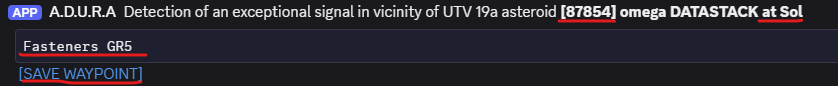
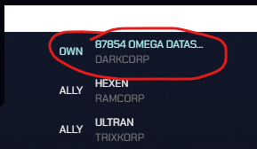

# Lov Signálov

* TOC
{:toc}

Lov signálov patrí medzi pokročilé aktivity a je vhodný pre hráčov, ktorí už majú nejaké skúsenosti v hre, majú rozbehnutú aspoň základnú ťažbu, spracovanie a výrobu komponentov. Lov signálov je pomerne jednoduchý, ak má hráč správne postavenú a vybavenú loď.

> **Upozornenie:**  
> Začínajúci hráči de-facto *nepotrebujú* loviť signály na to, aby vedeli rozbehnúť svoju kariéru, zarobiť peniaze a prestali trpieť nedostatkom.  
> Všetko potrebné (minimálne na prvé týždne hrania) si vedia hráči zohnať aj *bez lovenia signálov* (napr. nákup na NPC staniciach či od iných hráčov).  
> Signály sa obvykle lovia kvôli plánom na *pokročilé* alebo inak nedostupné moduly, zbrane a iné predmety, ktoré začínajúci hráči môžu prvé dni a týždne pokojne ignorovať.

---

## Dobrá rada na úvod

Najlepšie moduly na lov signálov sú bez debaty *Scioplex Lambda* antény. Veľmi často si úplní nováčikovia pýtajú od skúsených hráčov plány na výrobu alebo priamo hotové moduly.  

**NEROBTE TO!!!**

K Lambdám sa viete dopracovať sami, vlastnými silami a postupne. Nebude to ihneď, bude to trochu náročnejšie, ale o tom Outspace je. Jediné, čo si ušetríte, je vlastné hranie a radosť z neho. Zohnať si Lambdy vlastnými silami je pomerne jednoduché a rýchle.

---

## Stavba a vybavenie lode

Loď na lov signálov musí byť schopná skenovať signály vo vesmíre a stiahnuť ich čo najviac, v čo najkratšom čase. Zároveň potrebuje letieť relatívne veľké vzdialenosti za vzdialenými signálmi. Rýchlosť letu (a jeho dĺžka) v tomto prípade nie je kritická.

Z toho vyplýva, že loď na lov signálov musí byť *ľahká*, mať *dostatok energie* na dlhé lety a zároveň musí odviezť *čo najviac modulov* na sťahovanie signálov.

### Základné moduly

- **Veliteľský modul:**  
  Pathfinder MPCM

- **Pohon:**  
  Scioplex jadrový pohon, prípadne Heidberg H1

- **Warpy:**  
  Najľahšie, ktoré máte k dispozícii (ideálne Scioplex Terminal MK3) a len v takom počte, aby ste s loďou dokázali aktivovať warp.  
  Obyčajne sú 1–2 warp moduly dostačujúce. Odporúčam pozrieť [Source](https://source.outspacegame.com/cs/kosmicka-lod/moduly/list/&tag=warp) a porovnať hmotnosti warp modulov, ktoré máte k dispozícii, aby ste vedeli vybrať tie najľahšie.

- **Batérie:**  
  Jeden, ideálne dva batériové moduly TransPlan (sú ľahké). Ak ešte tieto moduly nemáte, postačia aj moduly od QFE (sú ale ťažšie).

- **Solárne panely:**  
  Keďže berieme len pár ťažkých batérií, musíme ich počas letu dobíjať. Preto na loď pridaj 2–4 solárne panely (Scioplex Solar M1 alebo neskôr Scioplex Solar M2).

### Moduly antén

Antény sú moduly, ktoré umožňujú skenovať vesmír a sťahovať signály. Lepšie moduly vám umožnia skenovať vzdialenejšie signály a uvidíte aj slabšie signály.

Pri slabších anténach budete vidieť iba silné signály (väčšinou obsahujú iba základné alebo nie veľmi vzácne plány) a skenovanie bude fungovať iba na bližšie signály. Väčší počet antén zase umožní paralelné sťahovanie signálov vo viacerých kópiách (napr. pri piatich anténach viete sťahovať 5 rôznych signálov alebo 5 kópií toho istého signálu *naraz*).

Každé sťahovanie signálu potrebuje vlastný voľný *výrobný slot* (klávesová skratka `W`). Takže ak máte na lodi 5 antén, ale iba 3 voľné výrobné sloty, môžete v jednej chvíli sťahovať len 3 signály.

Ako bolo spomenuté vyššie, cieľom je získať *Scioplex Lambda* antény. Tie sú však pomerne vzácne a dajú sa kúpiť iba zriedka. Na druhej strane, obyčajné Scioplex anténové pole, prípadne ešte lepšie Scioplex dvojité anténové pole sa dajú bežne kúpiť na NPC staniciach (nájdete cez Tradelink, klávesová skratka) za dostupné ceny.

Loď osadená 6× Scioplex dvojitou anténou vám určite postačí na to, aby ste si vedeli sami nájsť a stiahnuť signál obsahujúci plány na výrobu Scioplex Lambda antén.

### Astronauti

Astronauti sú kameňom úrazu pri hľadaní signálov. Potrebujete *veľa* astronautov, ktorí sú *vytrénovaní* v oblasti *vedy* (vedecký modifikátor – to je to posledné číslo v TES skóre) minimálne na úroveň maximálnej úrovne antény. Práve toto je dôvod, prečo je odporúčané začať s jednoduchšími anténami (vyžadujú **menej** astronautov) a k Lambde sa prepracovať postupne.

**Príklad:**  
Lambda anténa má limit na vedecký modifikátor max. 96, to znamená, že do *každého* modulu by mali ísť **štyria** astronauti s `S >= 96`!

> **Upozornenie:**  
> Na loď montujte iba antény **plne obsadené astronautami**!  
> To znamená, že ak máte anténový modul obsadený iba neúplným počtom astronautov, je lepšie ho *dočasne odmontovať* a namontovať až v okamihu, keď ho viete kompletne obsadiť!

> _**Veľké upozornenie:**_  
> Roboti sú vyrobení – pozor, prekvapenie – z kovu a kov **RUŠÍ** väčšinu signálov.  
> Roboti by mali mať zakázané sa k lodi na lov signálu čo len priblížiť!  
> Na takejto lodi neobsadzujte **ŽIADNU** pozíciu v žiadnom module robotom, ani robota na takejto lodi *neprevážajte* (nepriradeného na stanovisko).  
> Jasné, že to platí len vtedy, ak plánujete loviť a sťahovať signály.

> **Dobrá rada:**  
> Nikto nevie prečo, ale zdá sa, že astronauti s povolaním **MEDIK**, umiestnení do anténových modulov, vykonávajú svoju prácu lepšie ako iné profesie…

---

## Hľadanie a skenovanie signálu

Signály je možné loviť aj ad-hoc. Stačí odletieť „kúsok“ ďalej od stanice (stanica je tiež z kovu!) a pozrieť si zoznam signálov, ktoré viete zachytiť. Takýto signál viete okamžite začať sťahovať.

Problém je, že na lov signálu väčšinou máte konkrétny dôvod – potrebujete nájsť plán na výrobu konkrétneho modulu, zbrane alebo iného predmetu. Preto je nutné takýto signál najprv nájsť a dopraviť sa k nemu.

Signály hľadáme a skenujeme zásadne zadokovaní na stanici, na ktorej máme povolené dobíjanie energie. Skenovanie je totiž energeticky veľmi náročné a loď má zásobu energie (v batériových moduloch) len obmedzenú.

> **Dobrá rada:**  
> Ja osobne skenujem zadokovaný na vlastnej stanici, ktorá má energie dostatok.  
> Ešte predtým, ako začnem skenovať, si na loď *dočasne* prihodím cca 8–10 batériových modulov, ktoré mám pripravené na sklade.  
> Toto je **LEN** pre účely skenovania, následne batérie *vrátim* na sklad!

### Postup skenovania

1. Zadokuj na stanicu, osaď batérie a dobi si loď doplna.
2. Prepni sa do Sektorovej mapy (klávesa `medzerník`).
3. Nastav si pohľad tak, aby si aj niečo videl (oddialiť a otočiť napr. smerom na stred sústavy).
4. Zapni zobrazenie signálov (horná ikona z trojice ikon na ľavej strane).

   

5. Po zobrazení signálov posúvaj *spodný posuvník* až do polohy, kedy sú zobrazené *menšie dátové* signály.

   

   Pri posúvaní sa v hornej časti obrazovky ukazujú aktuálne zobrazované typy signálov.  
   My hľadáme toto:

   

6. Horným posuvníkom si nastav intenzitu zobrazenia.  
   Na slabé signály osamotené v hlbokom vesmíre bude nutné úroveň zapnúť takmer na maximum, avšak vnútri slnečnej sústavy bude tento pohľad preexponovaný.
7. Plnohodnotne skenovať signál (teda vidieť „čo obsahuje“) vieme len signál, ktorý naša loď zachytáva na 100 %.  
   Anomálie slabšie ako 100 % naši astronauti nevedia skenovať a nedozvieme sa, aké výrobné plány sú v nich ukryté.  
   To znamená, že po nastavení kurzora myšky na niektorú z „bodiek“ (to sú anomálie, z ktorých sa signály skladajú) sa musí objaviť niečo takéto:

   

8. Na bodku kliknite pravým tlačidlom myšky a z kontextového okna zvoľte **Skenovanie anomálie**.  
   Zároveň si všímajte aj vzdialenosť k anomálii, či je vôbec reálne tam letieť.

   

9. Otvorí sa nasledovné okno, v ktorom budeme anomáliu (resp. signál) skenovať.

   

10. Dôležité je všimnúť si nasledovné detaily:

    - anomália obsahuje dátový signál (vysoký vertikálny stĺpec histogramu bledomodrej farby),
    - po nastavení kurzora myšky nad tento signál sa zobrazí malé okno, kde môžeme vidieť:
      - počet signálov, ktoré danou anomáliou prechádzajú (v našom prípade dva),
      - veľkosť energie za oskenovanie každého signálu (v našom prípade 665 EU).

11. Prvý a každý ďalší signál v danej anomálii (poradie skenovania si nevieme vybrať) oskenujeme jednoduchým kliknutím na daný histogram.  
    Po každom kliknutí sa signál oskenuje, loď stratí určené množstvo energie a zobrazí sa výsledok skenovania.

    Ak na jednotlivé zložky signálu (v našom prípade len jedna jediná) ukážeme myškou, objaví sa nám názov predmetu, ktorého výrobný plán daný signál obsahuje:

    

    > **Dobrá rada:**  
    > V prípade, že v anomálii ešte ostali nepreskenované signály:
    >
    > 
    >
    > avšak energia lode už nestačí na ich skenovanie:
    >
    > 
    >
    > oceníte fakt, že ste stále zadokovaní na stanici.  
    > **PONECHAJTE OKNO SKENOVANIA OTVORENÉ** a vykonajte nasledovné kroky na dobitie lode a dokončenie skenovania všetkých ostávajúcich signálov:
    >
    > - stlačte `Esc` (nebojte sa, okno sa nezatvorí) a pohľad sa presunie zo Sektorovej mapy späť do štandardného pohľadu,
    > - otvorené dialógové okno so skenovaním môžete myšou chytiť a presunúť niekam nabok, aby nezavadzalo (nie zatvoriť!),
    > - vojdite do Hangáru a dobite loď,
    > - následne môžete skenovacie okno potiahnuť znova do stredu obrazovky a dokončiť skenovanie,
    > - celý postup môžete opakovať znova a znova.

12. Ak ste konečne našli to, čo ste hľadali, musíme vytvoriť *WAYPOINT* k danej anomálii, pretože inak ju budete musieť hľadať znova.  
    Ešte stále v skenovacom okne sa *dolu vpravo* nachádza tlačidlo na **Vytvorenie waypointu**.

    Po jeho stlačení sa objaví okno, v ktorom zadajte váš vlastný názov.  
    **ODPORÚČAM** do názvu zahrnúť aj číslo signálu, ktoré je stále zobrazené v okienku s obsahom daného signálu (v našom prípade 87553), čiže uložím si waypoint pod názvom `87553_HLO-HIVE`. Waypoint zatiaľ ponechajte ako súkromný, pretože ukazuje len *anomáliu*, nie presné miesto ideálne na *sťahovanie signálu*.

    

13. Posledným krokom prípravy je *naplánovanie* trasy, resp. určenie stanice, z ktorej je optimálne štartovať.  
    Pozatváraj všetky otvorené skenovacie okná, vypni zobrazenie signálov a otvor Sektorovú mapu.
14. Otvor si zoznam waypointov (zakrúžkovaná ikona v pravom zozname), nájdi tvoj waypoint a klikni naň myškou:

    

15. Sektorová mapa sa automaticky *vycentruje* na daný waypoint.  
    Tvoja úloha je pomocou otáčania (pravý klik myšky) a posúvania (ľavý klik myšky) mapy nájsť stanicu tvojej zóny, ktorá je k danému waypointu najbližšie.

    Ak si si nie istý, pokojne nájdi viac kandidátov, neskôr otestujeme všetkých.  
    Cieľom je nájsť takú stanicu, na ktorú sa vieme presunúť stázovou kartou (okamžite) a z nej bude daný waypoint najbližšie (optimalizujeme dĺžku letu).

    

**Hotovo**, príprava na lov je hotová.  
Nezabudni na **odmontovanie** a **vyloženie** nadbytočných batériových modulov (na lodi nechaj max. 1–2 kusy) a **dobitie** lode doplna!

---

## Začiatok letu za signálom

Ak máš vytvorený waypoint, máš zapísané číslo signálu (ideálne v názve waypointu), na lodi ani v jej nákladovom priestore nemáš zbytočné batérie ani robotov a loď máš doplna nabitú, môžeš sa vydať na lov.

1. Pomocou stázovej karty (alebo inak, ak chceš viac reality) sa presuň na stanicu, ktorú si si určil ako štartovaciu.  
   Ak máš viacerých kandidátov na štartovacie stanice, navštív postupne všetky.  
   Na stanici nedokuj, ostaň len niekde v blízkosti.
2. Znova otvor Sektorovú mapu, otvor zoznam waypointov a klikni na tvoj waypoint.  
   V otvorenom kontextovom okne si všimni, aká je vzdialenosť k danému waypointu z aktuálnej stanice.

   

   Ak máš viacerých kandidátov, tieto dva body zopakuj pre každého z nich a nájdi stanicu najbližšie k tvojmu waypointu.
3. Ak je signál dostatočne silný, alebo nie je príliš vzdialený, existuje šanca, že ho uvidíš aj v zozname signálov.  
   Ak máš označenú tvoju aktuálnu loď na lov signálov (klávesová skratka `M`), klikni myškou na ikonu antény v dolnom menu:

   

4. Vpravo sa otvorí zoznam signálov, ktorý tvoja loď (resp. astronauti v nej) vidí:

   

   Skús v zozname nájsť tvoj signál podľa jeho čísla.  
   Ak je rušenie stanice príliš veľké, oplatí sa odletieť (bez warpu!) „pár kilometrov“ nabok (ktorýmkoľvek smerom) a skúsiť znova.
5. Ak sa ti podarilo signál nájsť, použi ikonu `>>` v danom okne a loď sa automaticky rozbehne smerom k *najlepšiemu miestu na sťahovanie signálu*.  

   > **Upozornenie:**  
   > Toto miesto sa môže značne odlišovať od tvojho waypointu, ale žiadna panika.  
   > Väčšinou je presnejšie (aj keď nie úplne presné) ako tvoj waypoint.

6. Ak sa ti signál v zozname nájsť nepodarilo, je to v poriadku. Buď je slabý alebo príliš ďaleko.  
   Jednoducho začni let priamo na tvoj waypoint a finálny cieľ časom skorigujeme.

---

## Kontrola signálu počas letu

### Zmena cieľa počas letu

Zmena cieľa sa týka len prípadu, kedy si od štartovacej stanice letel smerom na waypoint. V takom prípade je pravdepodobné, že netrafíš pozíciu, na ktorej by si vedel sťahovať signál optimálnou rýchlosťou.

Preto počas letu smerom na waypoint *pravidelne* sleduj zoznam signálov a hľadaj, kedy sa tam objaví tvoj signál. Vtedy odporúčam vyčkať na koniec aktuálneho „warpového skoku“, prípadne zastaviť warp až pri jeho konci (sleduj zostávajúci čas v ľavom hornom rohu), aby si zbytočne neplytval energiou.

Akonáhle máš signál v zozname a aktuálny „skok“ warpom končí (ostáva cca 10–20 minút), loď zastav a použi ikonu `>>` v zozname signálov, aby si poslal loď na presnejšiu pozíciu signálu. Ďalej pokračuj pravidelnými kontrolami podľa kapitoly „Predčasné ukončenie letu“.

### Predčasné ukončenie letu

Pri väčšine signálov nie je potrebné letieť až priamo „do signálu“.  
Je nutné si uvedomiť, že aj najlepšie antény potrebujú čas na stiahnutie veľkého množstva dát.

Platí, že v **ideálnom prípade** sa **1 MB** signálu sťahuje **minimálne 12 minút**.  
To znamená, že sťahovanie signálu o veľkosti napr. 12 MB bude (bez pomoci kariet) trvať minimálne `12 MB * 12 min = 144 min = 2 h 24 min`.

Akonáhle vidíš, že tvoj signál sa dá za takýto „optimálny“ čas stiahnuť, je zbytočné letieť ďalej.  
Vtedy treba okamžite zastaviť loď a začať sťahovať.

Môže sa dokonca stať, že pokračovaním v lete by sa čas sťahovania mohol predĺžiť!

Veľkosť signálu a čas jeho sťahovania z aktuálnej pozície (dá sa kontrolovať kedykoľvek počas warpovania!) je vidno v zozname signálov:

Napríklad tento signál je možné okamžite stiahnuť optimálnou rýchlosťou (20 MB za 4 h), hoci je loď od signálu vzdialená ešte viac ako 5,8 AU!

Ak čas sťahovania nedosahuje rýchlosť 1 MB / 12 min, odporúčam pokračovať v lete, prípadne vylepšiť anténové moduly a/alebo ich osadiť viac trénovanými astronautami.

## Bonus: Signály v Discord kanáli 'adura-channel'

A.D.U.R.A je Discord chat bot, ktorý automaticy zobrazuje dôležité udalosti v hre. V nepravidelných intervaloch uverejňuje približné pozície zaujímavých signálov vo vesmíre. Každá takáto správa obsahuje odkaz na stránku, pomocou ktorej sa vygeneruje súkromný waypoint na danú pozíciu.

> **Upozornenie:**  
> Takýto waypoint je tiež len približný, takže počas letu bude nutná presnejšia navigácia podľa predchádzajúcich kapitol.

Samozrejme, predpokladom sledovania týchto správ je registrácia a pripojenie sa k [Oficiálnemu Discord serveru](https://discord.com/invite/xrVe4fB) hry Outspace.

1. Otvor Discord (či už cez webový prehliadač alebo aplikáciu Discord) a nájdi kanál `adura-channel`.
2. Hľadaj relatívne nedávne správy o detegovaných signáloch.  
   Správa vyzerá približne takto:

   

   Dôležité je všimnúť si nasledovné detaily:
     - ID číslo signálu
     - Sústavu, v ktorej sa signál nachádza (pre začiatočníka je to určite **Sol** - Slnečná sústava). Signály hľadaj len v sústavách, kde máš vytvorené stanice a vieš sa k nim dostať!
     - Obsah signálu - čiže názov predmetu, ktorého výrobný plán daný signál obsahuje.
     - Odkaz na vytvorenie signálu (*SAVE WAYPOINT*)

3. Ak ťa signál zaujal, klikni na odkaz *SAVE WAYPOINT*.  
   Otvorí sa nové okno (alebo záložka) internetového prehliadača.  
   **NIČ NEKLIKAJ**, len chvíľu čakaj a sleduj obrazovku.
4. Po chvíli sa v strednej hornej časti objaví informácia o úspešnom vytvorení waypointu:

   

5. Okno (alebo záložku) môžeš zavrieť a vrátiť sa do pôvodného okna s hrou.
6. Otvor Sektorovú mapu a zobraz zoznam waypointov.
   Úplne na vrchu by sa mal nachádzať tvoj nový waypoint:  

   

7. Doporučujem na waypoint kliknúť a pomocou kontextového menu *premenovať*, napr. v našom pípade na *87854_Fasteners-GR5*.
8. Ďalej už pokračuj štandardným spôsobom, ako bolo popísané vyššie.
