# Stavba stanice

* TOC
{:toc}

Stavba prvej stanice či následne ďalších staníc nie je vôbec komplikovaná a z väčšej časti majú hráči úplne voľné ruky v tom, ako si svoju stanicu navrhnú a postavia. Existuje niekoľko málo pravidiel a odporúčaní, ktoré je nutné alebo vhodné pri stavbe dodržiavať.

> **Terminológia**
> Noví hráči často pri kladení otázok používajú nesprávnu terminológiu, čím vznikajú rôzne nedorozumenia.
> Jednotlivé časti stanice nazývame **bloky**. Niektoré bloky umožňujú osadiť ďalšie **zariadenia**.
> Bloky je nutné odlišovať od *modulov*, ktoré sa umiestňujú na *lode*.
> **V skratke:** na lodi sú *moduly*, na stanici sú *bloky*.

## Nová stanica

Prvú stanicu si nový hráč postaví vrámci tutoriálu, ktorý je súčasťou hry a sprevádza nových hráčom prvými krokmi v hre. Pokročilejčí hráči, ktorí spĺňajú určité kritériá (napr. úroveň svojej hlavnej stanice), môžu postaviť aj ďalšie stanice. Stačí ľubovoľnou loďou priletieť na miesto, kde by mala stanica stáť a v menu Produkcia (klávesová skratka `w`) kliknúť na tačidlo pre vytvorenie novej stanice:

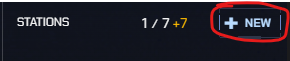

### Kde postaviť stanicu ?

Výber pozície novej stanice je *veľmi dôležitá*, pretože po postavení sa stanica **nedá presunúť**. Existuje len možnosť *stanicu rozobrať*, pozbierať z nej materiál a následne postaviť *novú stanicu* na inom mieste.

Pravidlá hovoria, že novú stanicu *nie je možné postaviť* v *"blízkosti"* inej stanice, či už hráčskej alebo NPC. Táto vzdialenosť sa líši podľa toho, či daná stanica patrí cudziemu hráčovi, hráčovi z rovnakej zóny alebo NPC. V každom prípade je vhodné postaviť si stanicu na mieste, kde je relatívny kľud.

> **Stanicu nemôžeš postaviť bližšie ako:**
> 80km od vlastnej alebo inej stanice patriacej do tvojej zóny
> 250km od stanice patriacej hráčovi z inej zóny
> 5500km od NPC stanice

Keďže základom úspešného postupu v hre ťažba a spracovanie vyťaženého materiálu, je veľmi výhodné mať stanicu:
- v blízkosti fragment, ktorého čistota je (ideálne) 100%
- v blízkosti NPC stanice, kde bude možné vyťažený materiál spracovať

> Tieto odporúčania nemusia dodržať hráči, ktorí plánujú veľmi skorý vstup do hráčskej zóny, pretože vrámci zóny je možné sa medzi stanicami presúvať cez stázovú kartu a taktiež využívať rozvinuté stanice hráčov zóny na spracovanie materiálu a výrobu predmetov.

### Povinné bloky

Každá stanica má *dva povinné bloky*, bez ktorých nemôže existovať. Pri stavbe novej stanice sa otvorí dialógové okno, kde je nutné tieto bloky zvoliť. V hornej časti sa volí *veliteľský blok*, v spodnej časti *servisný blok*. V pravej časti je zobrazená celková cena stanice a čas potrebný na jej postavenie, ako aj viditeľnosť stanice ostatnými hráčmi (viditeľnosť je možné kedykoľvek zmeniť v *Nastaveniach stanice*, viď nižšie).

> **Upozornenie:**
> Poplatok za stanicu nie je všetko, čo si stavba stanice vyžaduje.
> Na stavbu je po zvolení povinných blokov nutné doručiť **stavebný materiál**, bez ktorého sa stavba *nezačne*!
> Je na zvážení hráča, aby si vopred naštudoval množstvo požadovaných materiálov a na základe toho sa rozhodol,
> ktoré bloky zvládne postaviť. [Odkaz na príslušnú kapitolu v Source](https://source.outspacegame.com/cs/vesmirna-stanice/bloky/list/)

#### Veliteľský blok

Zvolený typ a úroveň veliteľského bloku určuje všetky hlavné parametre stanice. Na tento blok sa neskôr môžu postupne pripájať ďalšie bloky a hráč si tak môže rozširovať svoju stanicu, jej parametre a poskytované služby. Pri voľbe *typu veliteľského bloku* ponúka hra dve možnosti - **Vodnár** a **Odysea**.

> **Dobrá rada:**
> Novým hráčom sa vo všeobcnosti doporučuje zvoliť **Odyseu**, pretože v porovnaní s Vodnárom má *väčššiu schopnosť údržby* a taktiež povoľuje postaviť až 2 *ubytovacie zariadenia*, čiže v základe poskytuje presne to vybavenie, na ktoré by sa mal nový hráč sústrediť.

Samozrejme, hráč by sa mal snažiť postaviť veliteľský blok *čo najvyššej úrovne*, pretože vzššie úrovne blokov ponúkajú výrazne lepšie parametre stanice.

#### Servisný blok

Na 'spodnej časti' stanice sa povinne nachádza *servisný blok*, ktorého úlohou je poskytovať stanici podporné služby. Noví hráči ocenia vyššiu úroveň údržby, preto by si mali na svoju prvú stanicu zvoliť blok **Odysea Údržbárska paluba 1**.

## Dodatočné zariadenia blokov

Niektoré bloky umožňujú pridať tzv. *zariadenia*. Sú to akési rozšírenia daného bloku, ktorými sa buď zlepšujú parametre (napr. množstvo ubytovacích jednotiek, príp. kapacita batérie na stanici), alebo sa pridávajú úplne nové služby (napr. Hangár, Recyklátor a pod.). Nové zariadenia je možné do bloku pridať *až po úplnom dokončení stavby daného bloku*.

1. Zadokuj na stanici ľubovoľnou loďou
2. Otvor Mostík
3. Myšou sa nastav na požadovaný blok a v plávajúcom okne vyber Nové Zariadenie

   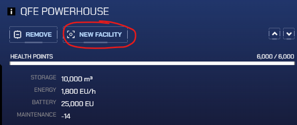

5. V ďalšom okne si môžeš zvoliť zariadenie, ktoré chceš na daný blok doplniť
   > Počet a typy zariadení, ktoré sa dajú na konkrétny blok nainštalovať, sú pevne dané typom bloku.
   > Preto nie je možné inštalovať iné zariadenie, príp. väčší počet zvoleného zariadenia.
6. Každé zariadenie potrebuje na postavenie materiál, preto stavba nezačne, kým na stavbu nepridáš požadované množstvá materiálov

## Staničné zbrane

V prvých dňoch kariéry má stanica hráča imunitu voči Zlu. To znamená, že hra nebude na túto stanicu aktívne posielať nájazdy Zla. Avšak po pár dňoch imunita končí a je na samotnom hráčovi, aby svoju stanicu ochránil. Ochrana je pomerne jednoduchá, treba vybudovať *staničné zbrane*.

Staničné zbrane sú štandardné bloky stanice, ktorých úlohou je aktívne vyhľadávať a ničiť nepriateľov v okolí stanice. To sa netýka iba hrou generovaného Zla, ale aj nepriateľov z radov hráčov (napr. hráčov, ktorí stanicu napadnú alebo hráčov z inej zóny - podľa nastavenia stanice).

1. Zadokuj loďou na stanicu
2. Otvor Mostík
3. V hornej časti je tlačidlo na pridanie nového bloku
4. V otvorenom okne pomocou tlačidiel `<` a `>` nájdi blok **Serpent HF100** a potvrď
5. Dodaj na stavbu potrebný materiál a počkaj na dokončenie výstavby

> **VEĽMI DÔLEŽITÉ!!!**
> Samotný blok Serpent HF100 **nevie** stanicu brániť, neobsahuje totiž **žiadnu zbraň**!!
> Zbraň je nutné po dobudovaní bloku manuálne osadiť:
> - otvor Mostík
> - nájdi tvoj nový blok Serpent HF100 a ukáž naňho kurzorom myši
> - zvoľ tlačidlo Zbrane v hornej časti
> - v otvorenom okne okne vyber *Primárnu zbraň*: **Laser KAZATEĽ**
> 
>   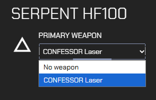

Takto vybavený blok dokáže aktívne chrániť stanicu proti nepriateľom.
Dovolím si uviesť ešte dve pomerne dôležité poznámky:
1. Staničné zbrane *nechránia* stanicu proti parazitom.
   Parazit je totiž tak malý organizmus, že tieto veľké zbrane nie sú schopné ho rozpoznať a zamerať.
2. Na skutočne účinnú obranu je nutné postaviť **ideálne 5 blokov** Serpent HF100 a osadiť ich zbraňami.
   Platí zásada - čím viac, tým lepšie.

## Energia a Údržba stanice

Každá stanica má množstvo rôznych parametrov podľa toho, z akých blokov a zariadení sa skladá.
Existujú však parametre, ktoré sú pre každú stanicu **kritické** a je nutné ich neustále **sledovať** a pred každou zmenou stanice **plánovať**. Akonáhle sa niektorý z týchto parametrov dostane do záporných čísel, stanica začína *degradovať a chátrať*. Pre správnu funkciu stanice je potrebné udržiavať tieto hodnoty bezpečne nad nulou.

Po zadokovaní *na vlastnú stanicu* je možné tieto parametre sledovať v hornom ľavom rohu obrazovky:

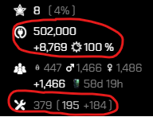

- **Energia** má uvedené nasledovné parametre:
  - celkovú kapacitu stanice
  - *hodinový zisk* energie stanice
  - efektivita zisku energie (závisí od veľkosti hviezdy a jej vzdialenosti stanice)
- **Údržba:**
  - absolútna hodnota údržby (schopnosť stanice sa opravovať)
  - v zátvorke je uvedená základná a bonusová zložka údržby

### Energia

Každá stanica potrebuje na svoj riadny chod *energiu*. Tú stanica získava zo svojej najbližšej hviezdy a uchováva v úložiskách energie. Dôležité pritom je, v akej vzdialenosti od tejto hviezdy je stanica postavená.

#### Získavanie energie

Energiu stanica zachytáva pomocou blokov (a ich zariadení). Niektoré bloky (a ich zariadenia) dokážu energiu zachytávať s pomerne veľkou efektivitou, iné sú menej efektívne a sú bloky, ktoré to nedokážu vôbec. Výborným zdrojom týchto údajov je [Source](https://source.outspacegame.com/cs/vesmirna-stanice/bloky/list/), kde každý blok a zariadenie má presne uvedenú hodnotu energie, ktorú dokáže za hodinu získať, príp. minúť.

Napríklad, veliteľský blok Odysea 3 má uvedené nasledovné údaje, podľa ktorých dokáže každú hodinu získať až 1800EU.

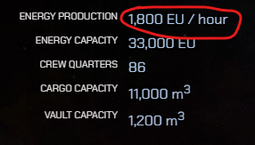

Na druhej strane, do tohto bloku vieme nainštalovať napr. Ubytovacie zariadenie (Hub), ktorý energiu *spotrebováva*:

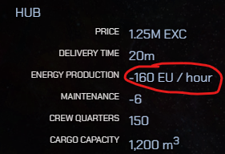

> **Dôležité:**
> Celkový súčet energetických **ziskov** a **strát** všetkých *blokov a zariadení* stanice nám dáva **energetickú bilanciu** stanice.
> Každý hráč sa snaží dosiahnuť *čo najvyššiu energetickú bilanciu* svojej stanice.

#### Ukladanie energie

Okrem schopnosti *získavať energiu* majú niektoré bloky a zariadenia schopnosť energiu aj *ukladať*. Tento parameter je dostupný na [Source](https://source.outspacegame.com/cs/vesmirna-stanice/bloky/list/) pre každý blok a zariadenie stanice. Napríklad, samotný veliteľský blok Odysea 3 má schopnosť uchovať až 33000EU.

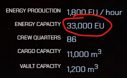

> Celková kapacita energie stanice sa vypočíta ako súčet kapacít všetkých jej blokov a zariadení.

### Údržba

Parameter Údržby stanice vyjadruje jej schopnosť sa opravovať. Pri nedostatočnej hodnote tohto parametra stanica stráca túto schopnosť a začína *degradovať*. Pri akejkoľvek zmene stanice je preto nutné vopred naplánovať, aký dopad na údržbu bude daná zmena predstavovať. Podobne ako pri energii, niektoré bloky stanice dokážu úroveň údržby *zvyšovať*, iné na ňu *nemajú vplyv* a ďalšie zase úroveň údržby *znižujú*.

Napríklad, samotný veliteľský modul Odysea 3 má malú, ale stále kladnú hodnotu údržby:

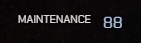

Naopak, [Obytný Prstenec Triton](https://source.outspacegame.com/cs/vesmirna-stanice/bloky/list/2/) celkovú hodnotu stanice drasticky znižuje:

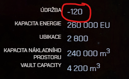

> **Dôležité:**
> Samotné *postavenie* blokov so schopnosťou zvýšiť údržbu **je nedostatočné**. Údržbu je totiž nutné aj
> **vykonávať**. Údržbu na stanici vykonávajú vždy **kolonisti**.
> Aby sa zvýšenie údržby *prejavilo*, je potrebné zabezpečiť na stanici **dostatočný počet kolonistov**.
> Preto sa môže stať, že po vybudovaní nového bloku (alebo prechodnom znížení počtu kolonistov) bude *dočasne*
> hodnota údržby nedostatočná. Akonáhle sa kolonisti opäť rozmnožia, vráti sa hodnota údržby na očakávanú úroveň.

#### Ďalšie zvyšovanie údržby

Úroveň údržby stanice je možné (a doporučené) zvyšovať aj iným sposobom, ako len budovať bloky s kladnou hodnotou údržby.
Existujú viaceré špeciálne karty, ktoré je možné 'zahrať' na stanicu a tým pádom zvýšiť úroveň jej údržby.

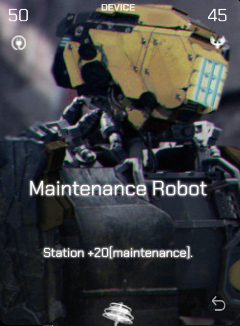 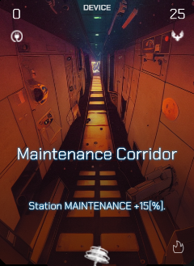

## Ďalšie vylepšovanie stanice

Stanica zložená len z Veliteľského bloku a Servisného bloku (pričom každý blok má osadené všetky dostupné zariadenia) je plne funkčná, ale už po krátkej dobe prestane postačovať. Vtedy je čas začať premýšľať o stavbe ďalších blokov. Znova upozorňujem, že stavba každého bloku vyžaduje okrem peňazí a produkčného slotu aj rôzne množstvo materiálu. Preto je nutné stavbu ďalších blokov dobre naplánovať.

> **Dôležité:**
> Pred začiatkom budovania nového bloku alebo zariadenia si dobre spočítaj, či aj po dokončení daného
> objektu bude mať stanica **dostatočný zisk energie a úroveň údržby**!!

Ďalšími blokmi, ktorými si môžeš svoju stanicu vylepšiť, sú napríklad:
- trhovisko (umožní predaj a výkup predmetov na vlastnej stanici)
- sklady (možnosť odkladať si svoje predmety, suroviny a výrobky)
- solárne panely a dodatočné batérie (pre zvýšenie zisku energie a kapacity úložného priestoru)
- ubytovanie pre ďalších kolonistov (zvýšenie údržby, príp. možnosť množenia)

## Nastavenia stanice

Každá stanica obsahuje pomerne veľké množstvo rôznych nastavení, ktoré ovplyvňujú jej správanie, fungovanie či vystupovanie voči iným hráčom.

### Všeobecné nastavenia

Asi najdôležitejším nastavením každej stanice je jej **názov**. Ten je možné kedykoľvek zmeniť vo *všeobecných nastaveniach* stanice:

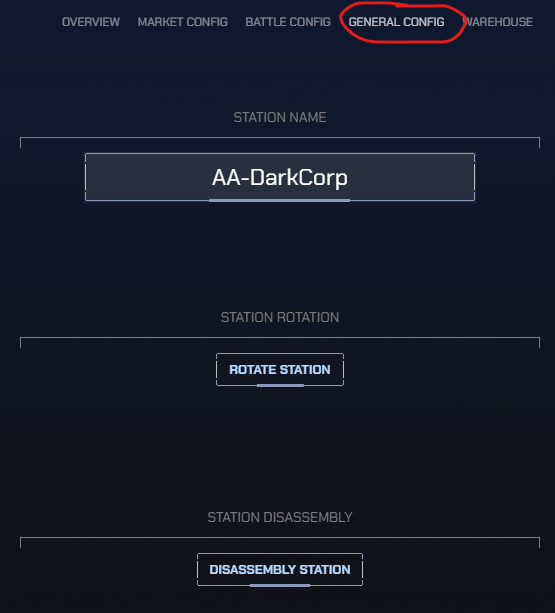

Okrem toho je možné stanicu v tejto obrazovke
- *natočiť*
- *rozobrať* (pozor, znamená de-facto *zrušenie stanice*!!)

### Nastavenie útoku

V tejto časti môže majiteľ stanice určiť, na koho budú staničné zbrane útočiť. Samozrejme, to platí len v prípade, ak boli bloky zbraní vybudované a osadené zbraňami. Na výber sú 4 možnosti útoku:

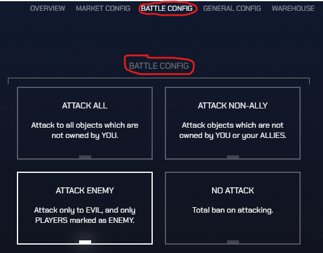

Po výbere jednej z možností bude stanica útočiť na objekty, ktoré
- nepatria majiteľovi (ak na to nemáš špeciálny dôvod, túto možnosť si **nevyberaj**!)
- nepatria majiteľovi alebo jeho spojencom (veľmi agresívne nastavenie)
- sú považované za nepriateľov (hráči so statusom *Nepriateľ* a všetky druhy Zla) - toto je doporučená voľba
- zákaz útočenia (zbrane sú deaktivované)

### Viditeľnosť stanice

Nastavenie viditeľnosti stanice určuje, ktorí hráči uvidia danú stanicu na radare, v sektorovej mape a vo výsledkoch globálneho vyhľadávania (klávesová skratka `U`). Toto nastavenie sa nachádza v rovnakej záložke ako *Nastavenie útoku*:

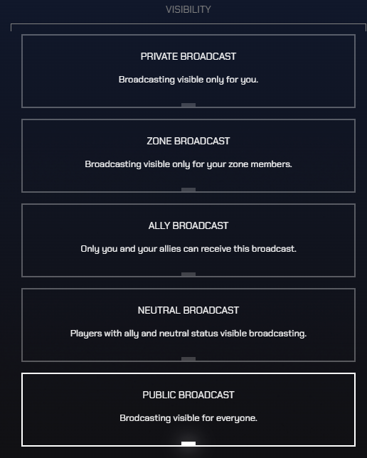

Na výber sú nasledovné možnosti, pre koho je stanica viditeľná:
- nikto okrem majiteľa
- majiteľ a hráči patriaci do rovnakej zóny
- majiteľ a hráči so statusom *Spojenec*
- majiteľ a hráči so statusom *Spojenec* a *Neutrálny*
- všetci hráči

> **Dôležité:**
> Ak chcete obchodovať s NPC hráčmi, viditeľnosť vašej stanice musí byť nastavená na *všetci hráči*. V opačnom prípade NPC hráči stanicu nedokážu nájsť, a teda ani na nej nakupovať.

## Výmena veliteľského bloku

Keď hráč nadobudne viac skúseností, zarobí viac peňazí a má dostatočné zásoby stavebného materiálu, môže svoj veliteľský blok vymeniť za lepší, príp. úplne zmeniť typ bloku. Veliteľské bloky vyššej úrovne spravidla poskytujú lepšie základné parametre pre zisk a kapacitu energie, údržbu a ubytovanie.

> Výmena veliteľského bloku prebehne tak, že aktuálny blok sa *rozoberie*, pričom sa stavebný materiál 'vyhodí do vesmíru v okolí stanice'. Tento materiál je možné pozbierať a znova použiť na stavbu nového veliteľského bloku. To znamená, že pri výmene bloku nie je nutné vlastniť celkové množstvo materiálu potrebné na stavbu stanice.

1. Po zadokovaní na stanici otvor Mostík
2. Kurzor myši presuň nad veliteľský blok
3. V hornej časti zvoľ tlačidlo na výmenu bloku

   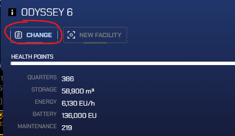

4. V novom okne vyber nový veliteľský blok
5. Po potvrdení vydokuj s (nákladnou) loďou, pozbieraj materiál v okolí stanice a použi ho na stavbu nového bloku

> **Dôležité:**
> Počas stavby nového bloku stanica *nemá veliteľský blok* ani žiadne z jeho zariadení. Stanica preto až do okamihu dokončenia stavby bloku nemusí poskytovať niektoré služby, ak ich neposkytuje iný blok (napr. Hangár).
